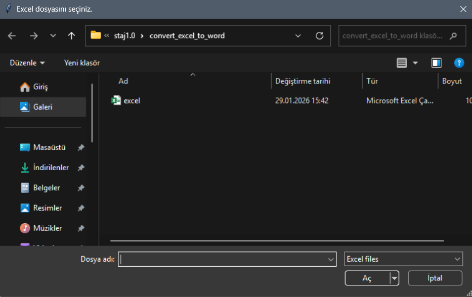
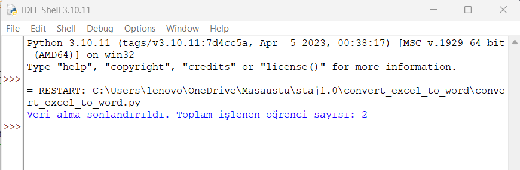
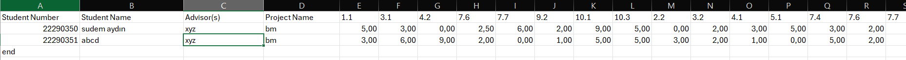
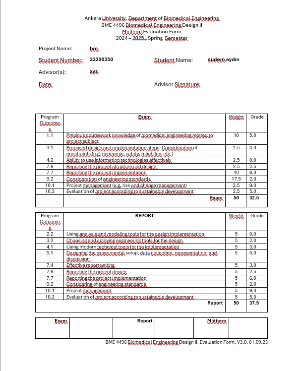

# CONVERT EXCEL TO WORD

This project reads student data from an Excel file and automatically fills a Word template (sablon.docx).
A separate Word file is created for each student.
It is useful for project, report, or jury evaluation forms.

## Technologies

- Python 3
- pandas
- python-docx
- tkinter (for file selection)

## How It Works

- Run the Python script
- Select the Excel file from the window

- Make sure sablon.docx is in the same folder
- The program:
  - Reads data from Excel
  - Fills the Word template
  - Creates one .docx file per student
  

## Excel File Format

## Word File Format

